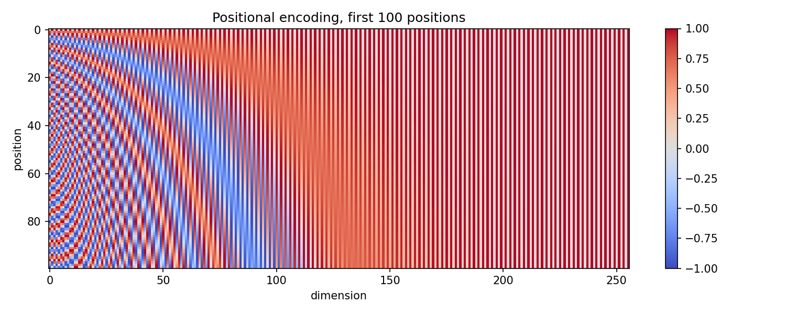
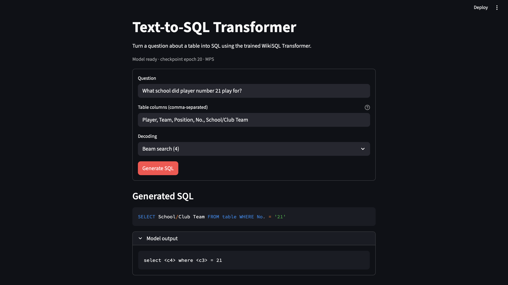

# Text-to-SQL with the Transformer

An encoder–decoder Transformer (Vaswani et al., 2017), built and trained from scratch in PyTorch,
that turns an English question about a table into a WikiSQL query.

> Generative AI — Assignment 02 (Fall 2026)

## Repository layout

| Path | Contents |
|---|---|
| `starter/` | the four given files and `check_starter.py`, unchanged |
| `model/attention.py` | scaled dot-product and multi-head attention |
| `model/layers.py` | feed-forward, encoder layer, decoder layer |
| `model/transformer.py` | full model and masks |
| `train.py` | Task 3 – training |
| `decode.py` | greedy, beam search, parser, readable SQL |
| `evaluate_model.py` | prediction files, component accuracy, attention map |
| `results/` | prediction files, tables, figures, `samples.md` |
| `app/` | front end |
| `paths.py` | shared paths; puts `starter/` on `sys.path` so the given files are imported, never edited |
| `task1_stats.py` | Task 1.3 length statistics and Task 1.4 positional-encoding heat-map |

## Setup

```bash
pip install -r requirements.txt
git clone https://github.com/salesforce/WikiSQL
cd WikiSQL && tar xvjf data.tar.bz2 && cd ..
cd starter && ln -s ../WikiSQL WikiSQL
```

## Task 1 – Run the starter code

From inside `starter/`:

```bash
python data_prep.py
python tokenizer.py
python check_starter.py
```

Expected output of `check_starter.py` (batch lengths vary):

```
train_pairs.jsonl: kept 56336, skipped 19
dev_pairs.jsonl: kept 8421, skipped 0
src (64, 123) tgt (64, 31)
encoder input (64, 123, 256) decoder input (64, 30, 256)
```

Then, from the repository root:

```bash
python task1_stats.py    # Table 1 numbers + results/figures/positional_encoding.png
```

Output:

```
train: pairs=56355  source mean=42.55 max=222  target mean=14.77 max=65  over_long=19
dev: pairs=8421  source mean=42.49 max=167  target mean=14.79 max=44  over_long=1
test: pairs=15878  source mean=42.67 max=260  target mean=14.93 max=46  over_long=4
```

Lengths include `</s>` on the source and `<s> ... </s>` on the target. Only train drops
over-long pairs; dev and test keep every row so predictions line up with `dev.jsonl`.

### Positional-encoding heat-map (Task 1.4)



Each position receives a fixed sinusoidal vector added to its token embedding, giving the
Transformer information about token order. The sine and cosine waves use different
frequencies, so positions have distinct patterns across the 256 dimensions.

## Model configuration

| | |
|---|---|
| d_model | 256 |
| Heads h | 4 (d_k = d_v = 64) |
| Encoder / decoder layers | 3 / 3 |
| d_ff | 1024 |
| Dropout | 0.1 |
| Normalisation | post-norm, LayerNorm(x + Sublayer(x)) |
| Weight sharing | encoder embedding = decoder embedding = output projection |

## Training

Run the required single 20-epoch training run on a Colab or Kaggle GPU:

```bash
python train.py
```

Epoch losses are weighted by non-padding target-token counts; the per-batch
training objective is unchanged. The lowest dev loss selects `results/best.pt`.
`results/last.pt` stores the latest completed epoch for recovery:

```bash
python train.py --resume results/last.pt
```

Resume continues through epoch 20, rather than starting another 20 epochs. Keep
the run's `best.pt` alongside `last.pt`, so the previously selected checkpoint
remains available. Checkpoints include optimizer and random-generator states,
seed (42), configuration, tokenizer SHA-256, epoch history, device and PyTorch
version. Use the same data, tokenizer, hardware and environment when resuming;
identical results across devices or nondeterministic kernels are not guaranteed.
Older checkpoints without this metadata remain usable for evaluation but cannot
be resumed by this script.

Each completed epoch writes `results/training_history.json` (losses, step, LR,
and elapsed seconds), `results/figures/training_loss.png`, and
`results/figures/learning_rate.png` (the prescribed first 20,000 steps).

## Evaluation

From inside `WikiSQL/`:

```bash
python evaluate.py data/dev.jsonl data/dev.db ../results/dev_greedy.jsonl
```

## Results

### Table 1 – Data

| | Train | Dev | Test |
|---|---|---|---|
| Pairs | 56,355 | 8,421 | 15,878 |
| Mean / max source length (tokens) | 42.55 / 222 | 42.49 / 167 | 42.67 / 260 |
| Mean / max target length (tokens) | 14.77 / 65 | 14.79 / 44 | 14.93 / 46 |
| Pairs dropped as too long | 19 | – | – |

### Table 2 – Model and training

| | |
|---|---|
| Trainable parameters | 7,577,600 |
| Epochs trained / best epoch | 20 / 20 |
| Best dev loss | 1.4829 |
| Training time and GPU | 21.5 minutes / NVIDIA Tesla T4 |

### Table 3 – Official metrics

| Split | Decoding | Logical form (%) | Execution (%) | Parse failures (%) |
|---|---|---|---|---|
| Dev | greedy | 57.00 | 64.79 | 0.49 |
| Dev | beam (4) | 57.40 | 65.24 | 0.56 |
| Test | beam (4) | 57.49 | 64.59 | 0.50 |

### Table 4 – Component accuracy (dev)

| | |
|---|---|
| `sel` column correct (%) | 86.00 |
| `agg` correct (%) | 88.59 |
| `WHERE` clause correct (%) | 69.54 |

## Correctness checks

- [x] Causal mask
- [x] Padding mask
- [x] Attention rows sum to 1
- [x] Weight sharing (`is` check)
- [x] Learning-rate schedule plot (`results/figures/learning_rate.png`)
- [x] Gold round-trip (dev official evaluator: 100% logical-form and execution accuracy)

Model check output (`python checks.py`):

```
[PASS] attention rows sum to 1: max |row sum - 1| = 1.2e-07, max weight on masked keys = 0.0e+00
[PASS] multi-head attention: out (2, 3, 256), weights (2, 4, 3, 8), params 263,168, uninitialised: none
[PASS] encoder/decoder layers: params ffn/enc/dec = 525,568/789,760/1,053,440, decoder uses encoder output: True, no peeking at future: True
[PASS] encoder/decoder stacks: params enc/dec = 2,369,280/3,160,320, layers that ran: enc1 enc2 enc3 dec1 dec2 dec3
[PASS] causal mask: max change at earlier positions = 0.0e+00 (last position changed by 3.05)
[PASS] padding mask: source length 12 -> 19 with 7 extra <pad>: max output change = 4.1e-06
[PASS] weight sharing: output_projection.weight is embedding weight: True, encoder & decoder inputs use it too: True
[PASS] trainable parameters: 7,577,600
```

## Front end

Install the requirements and launch the Streamlit app from the repository root:

```bash
pip install -r requirements.txt
streamlit run app/streamlit_app.py
```

The app needs the inference weights in `results/inference.pt` and their matching
`starter/sql_sp.model` tokenizer. Enter a question and comma-separated table columns;
the app returns SQL with the supplied column names. Choose greedy decoding or beam
search (width 4).


